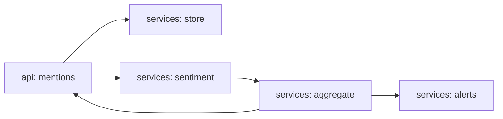

# agent-brand-monitor

[](https://github.com/Shamanchi/agent-brand-monitor/actions/workflows/ci.yml)
[](https://www.python.org/)
[](./Dockerfile)
[](./LICENSE)

> **English TL;DR:** FastAPI brand-monitoring agent: ingest mentions, keyword-based sentiment (EN+RU), aggregate sentiment index, negative-spike alerts, markdown digest. Fully offline, no tokens needed.

Агент мониторинга бренда: приём упоминаний, тональность по словарям (EN+RU), сводный индекс, алерты о всплеске негатива, markdown-дайджест. Работает офлайн.

Источник темы: `Hands-On-AI-Engineering / P-112 (brand_monitor_agent)` — идею и постановку взяли из каталога, код и тексты написаны с нуля.

## Какую задачу решает

Маркетологу нужно видеть тон упоминаний бренда и вовремя реагировать на негатив: агент собирает упоминания, считает индекс тональности, поднимает алерт при всплеске негатива и отдаёт дайджест.

## Архитектура



Слои: `api/` → `services/` → `core/`, настройки через `pydantic-settings`.

## Быстрый старт

```bash
cp .env.example .env
pip install -r requirements.txt
uvicorn app.main:app --reload
curl -X POST http://127.0.0.1:8000/api/v1/mentions -H "Content-Type: application/json" -d "{\"source\": \"x\", \"text\": \"Love Acme, great support!\"}"
curl "http://127.0.0.1:8000/api/v1/sentiment"
```

Docker:

```bash
docker compose up --build
```

## API

- `GET /api/v1/health` — проверка сервиса.
- `POST /api/v1/mentions` — добавить упоминание. Тело: `{"source": "x", "text": "..."}`.
- `GET /api/v1/mentions` — список упоминаний с тональностью.
- `GET /api/v1/sentiment` — агрегат: `index` (-1..1), доли классов, число упоминаний.
- `GET /api/v1/alerts` — алерты всплеска негатива.
- `GET /api/v1/digest` — markdown-дайджест.

Пример ответа `sentiment` (сокращённо):

```json
{
  "total": 4,
  "index": 0.0,
  "positive": 1,
  "neutral": 2,
  "negative": 1
}
```

## Переменные окружения (.env)

| Переменная | Назначение | По умолчанию |
|---|---|---|
| `NEGATIVE_WINDOW` | Окно последних упоминаний для алерта | `10` |
| `NEGATIVE_THRESHOLD` | Доля негатива в окне для алерта | `0.5` |
| `APP_HOST` / `APP_PORT` | Хост/порт API | `0.0.0.0` / `8000` |

Полный список — в [.env.example](./.env.example).

## Тесты

```bash
pip install -r requirements.txt
pytest -q
pytest -q -m integration
```

Unit-тесты без сети. Интеграционные (`-m integration`) — через TestClient, тоже без сети.

## Контакты

- Telegram: @PavelYrevichh
- Email: Lietman46@mail.ru
- GitHub: Shamanchi
- FL.ru: https://www.fl.ru/users/Shamanchi
